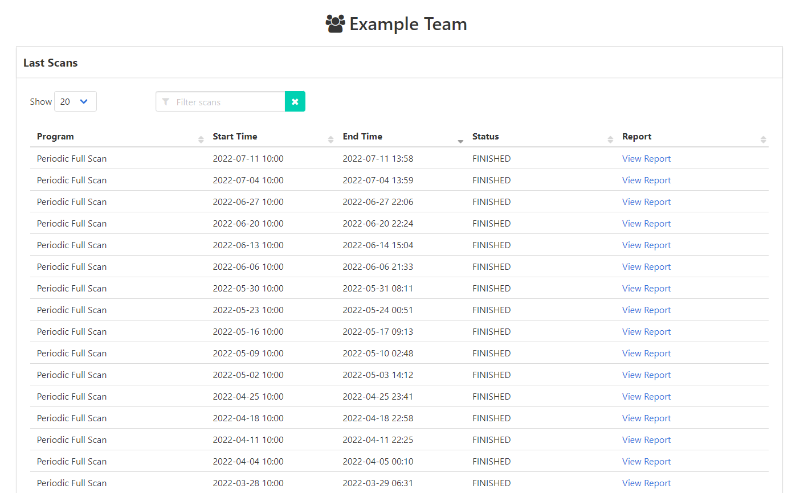
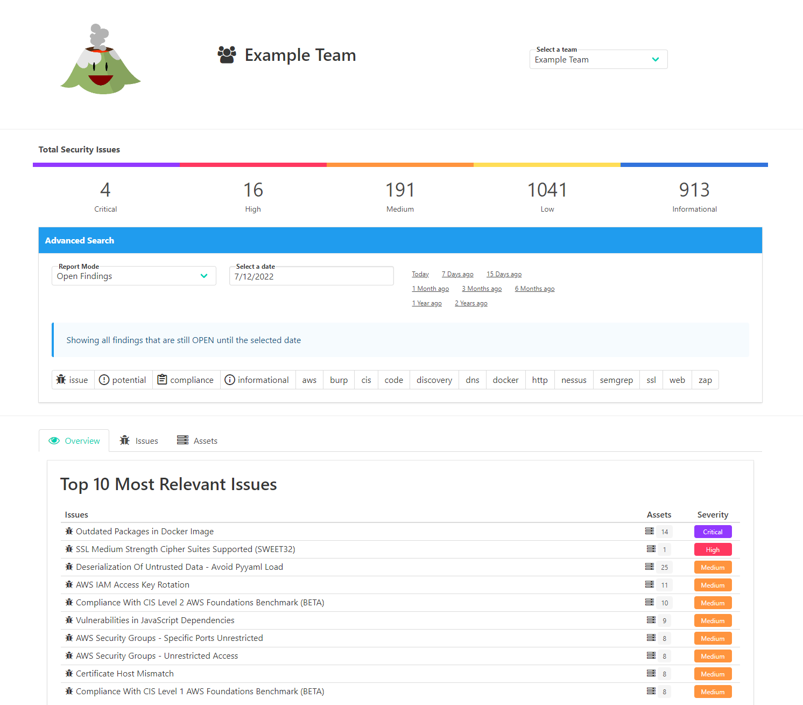
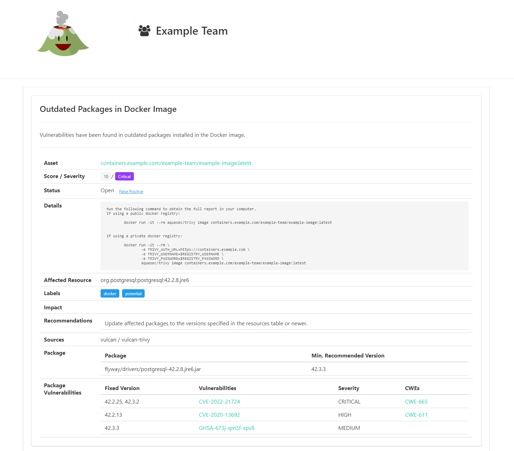

# Continuous Scanning

Teams can create their own Vulcan team and add their assets there simply by pasting a list of identifiers (e.g. web addresses, hostnames, Github URL, AWS account ARN...) through the Vulcan user interface. By default, Vulcan will automatically start scanning those assets with checks that have been assessed to be not intrussive on a weekly schedule. Teams can manage their owners, members and recipients, which will automatically receive a weekly report of the changes in the security of their assets. Through that report or directly on the Vulcan user interface, the team will be able to see which issues have been found in their assets and which assets need attention. All findings are accompanied with clear descriptions and information to help with remmediation. Users can autonomously mark findings as false positive and provide a rationale for it.

## Example

