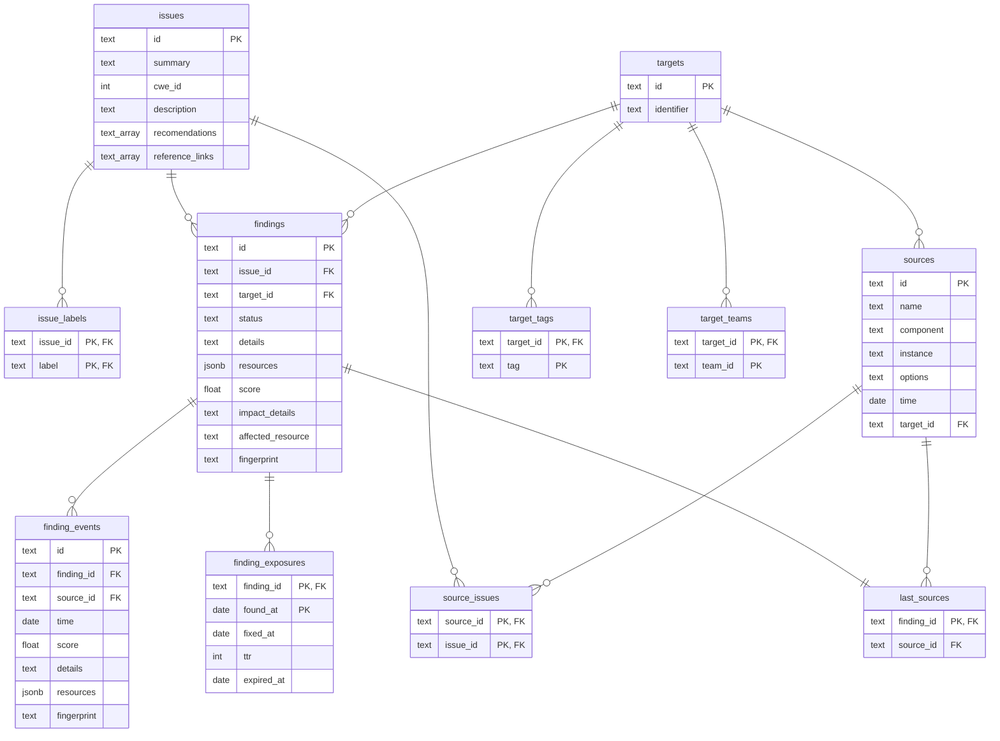

# Data Models

## Vulnerability DB

```mermaid
erDiagram
    issues {
        text id "PK"
        text summary
        int cwe_id
        text description
        text_array recomendations
        text_array reference_links 
    }
    issue_labels {
        text issue_id "PK, FK"
        text label "PK, FK"
    }
    findings {
        text id "PK"
        text issue_id "FK"
        text target_id "FK"
        text status
        text details
        jsonb resources
        float score
        text impact_details
        text affected_resource
        text fingerprint
    }
    finding_events {
      text id "PK"
      text finding_id "FK"
      text source_id "FK"
      date time
      float score
      text details
      jsonb resources
      text fingerprint
    }
    finding_exposures {
      text finding_id "PK, FK"
      date found_at "PK"
      date fixed_at
      int ttr
      date expired_at
    }
    sources {
      text id "PK"
      text name
      text component
      text instance
      text options
      date time
      text target_id "FK"
    }
    source_issues {
      text source_id "PK, FK"
      text issue_id "PK, FK"
    }
    last_sources {
      text finding_id "PK, FK"
      text source_id "FK"
    }
    targets {
      text id "PK"
      text identifier
    }
    target_tags {
      text target_id "PK, FK"
      text tag "PK"
    }
    target_teams {
      text target_id "PK, FK"
      text team_id "PK"
    }
    targets ||--o{ target_tags : ""
    targets ||--o{ target_teams : ""
    targets ||--o{ findings : ""
    targets ||--o{ sources : ""
    sources ||--o{ source_issues : ""
    sources ||--o{ last_sources : ""
    issues ||--o{ source_issues : ""
    issues ||--o{ findings : ""
    issues ||--o{ issue_labels : ""
    findings ||--o{ finding_events : ""
    findings ||--o{ finding_exposures : ""
    findings ||--|| last_sources : ""
```
